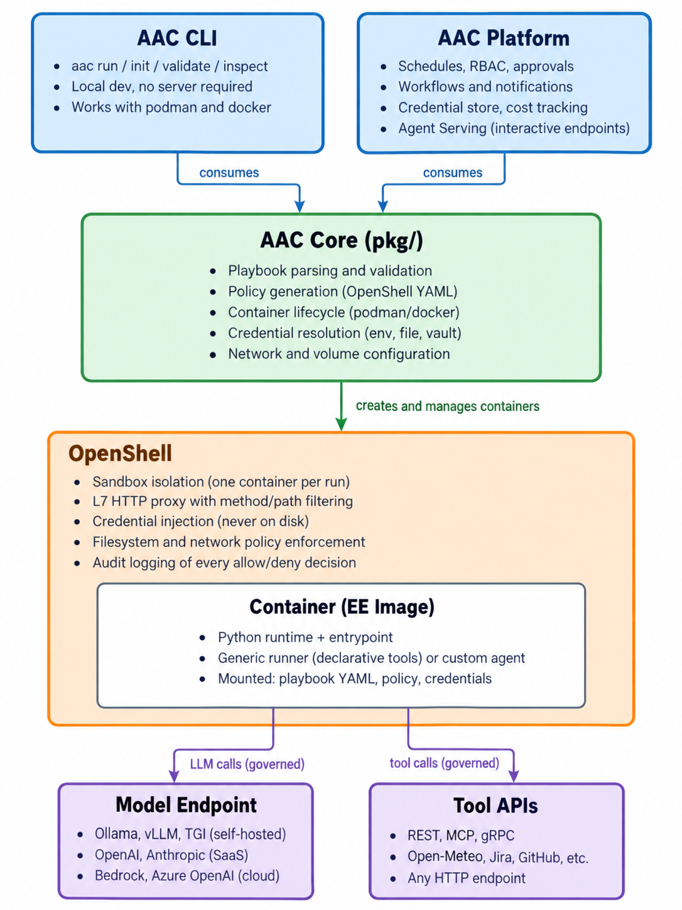

# Agent Automation Controller (AAC)

An enterprise automation controller for AI agents. Same concept as Ansible Automation Platform, but for agents instead of infrastructure automation.

## Documentation

| Document | What it covers |
|----------|---------------|
| [Why](why.md) | The problem, who needs this, scenarios |
| [What](what.md) | Product definition, requirements, MVP, competitive position, business model |
| [How](how.md) | Architecture, playbook format, execution flow |
| [Component boundaries](component-boundaries.md) | OpenShell vs Core vs CLI vs Platform, two enforcement layers, ownership matrix |
| [Competitive landscape](competitive-landscape.md) | Competitor deep dives, where we win, where we don't |
| [Backlog](backlog.md) | Future ideas and capabilities |

## Status

Internal working documents, v0.9.
