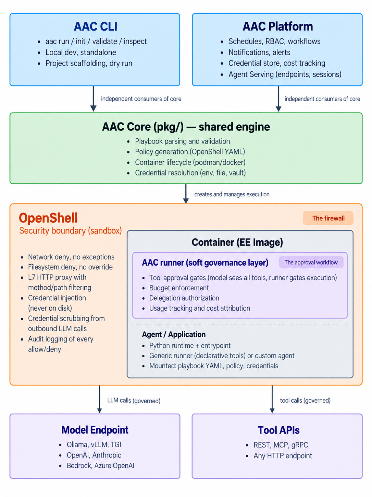

# Component boundaries

## The four components

AAC has four components: the CLI, the Platform, Core, and OpenShell underneath. If we don't draw clear lines, we'll either build a CLI that tries to be a control plane, or a platform that reimplements local dev tooling. Both are bad.

The Ansible ecosystem got this right. The Ansible CLI reads playbooks, resolves variables, connects to hosts, runs tasks. AWX/AAP schedules jobs, manages credentials across teams, enforces RBAC, sends notifications. They share the playbook format but have completely different responsibilities. You can use Ansible CLI without AWX and get real work done. AWX without Ansible CLI doesn't make sense.

Same principle here.



## Two enforcement layers

OpenShell and AAC handle different kinds of governance. They don't overlap.

### OpenShell: hard security boundary

OpenShell enforces things that should never happen, regardless of who approves. No exceptions, no human override. This is the firewall.

| Responsibility | Example |
|---------------|---------|
| Network deny | Agent can never reach 10.0.0.0/8 |
| Filesystem deny | Agent can never write to /etc |
| Sandbox isolation | One container per agent run, full process isolation |
| Credential injection | Secrets injected as env vars, never written to disk |
| L7 HTTP filtering | Method/path filtering per endpoint |
| Credential scrubbing | Redacts injected secrets from outbound LLM calls before they reach the model |
| Audit events | Logs every allow/deny decision |

The proxy knows exactly which credentials were injected into the sandbox (it did the injection), so it can match those values in outbound payloads to the model endpoint and redact them. No agent framework can do this from the inside. The agent doesn't know what's sensitive. OpenShell does.

OpenShell doesn't know what a playbook is, who launched the run, whether there's an approval pending, or what the agent is trying to accomplish. It enforces the policy it's given, full stop.

### AAC runner/platform: soft governance layer

AAC handles things that can happen with the right authorization. The model sees all available tools and can reason about them, but the runner gates execution of restricted tools until a human approves. This is the approval workflow.

| Responsibility | Example |
|---------------|---------|
| Tool approval | Agent can call refund API, but needs admin approval first |
| Usage tracking | Agent can query analytics endpoint, usage is metered |
| Delegation authorization | Agent can delegate to finance-data agent, if policy allows |
| Budget enforcement | Agent can make API calls until $50 budget is hit |
| Cost attribution | Track tokens and API calls per run |

The model needs to know all tools exist so it can plan properly. An incident response agent that doesn't know it could restart a service is useless. It should propose the action, then a human greenlights it.

### How the two layers interact

```yaml
# Playbook: incident-responder

policy:
  # Hard security - OpenShell enforces, no exceptions
  filesystem:
    read_write: [/tmp]
    read_only: [/usr, /lib, /etc, /aac]
  network:
    deny: [10.0.0.0/8]

tools:
  - name: get_alerts
    # No approval needed - always allowed
    http:
      method: GET
      url: "https://monitoring.internal/api/alerts"

  - name: restart_service
    approval: required
    approvers: [sre-oncall]
    # Runner gates this - human must approve before HTTP call executes
    http:
      method: POST
      url: "https://deploy.internal/api/services/{service}/restart"
```

OpenShell enforces the network deny (agent can never reach 10.0.0.0/8) and filesystem rules. The runner handles tool approval: when the model calls `restart_service`, the runner pauses, notifies the SRE on-call, waits for approval, then executes the HTTP call or returns a denial to the model.

OpenShell never sees the approval logic. The runner never touches network policy. Two layers, two purposes.

## Component ownership

### OpenShell (execution layer)

Owns the sandbox. Doesn't know or care about anything above it.

| Responsibility | Details |
|---------------|---------|
| Sandbox isolation | One container per agent run, full process isolation |
| Policy enforcement | Filesystem, network, process policies applied at kernel/network level |
| Credential injection | Provider system injects secrets as env vars, never on disk |
| Network interception | L7 HTTP proxy, method/path filtering per endpoint |
| Credential scrubbing | L7 proxy redacts secrets from outbound LLM calls before they reach the model endpoint |
| Audit events | Logs every permission decision (allow/deny) per sandbox |
| Compute drivers | Docker, Podman, Kubernetes, MicroVM |

### AAC Core (shared engine)

The ansible-core equivalent. Both CLI and Platform consume this library.

| Responsibility | Details |
|---------------|---------|
| Playbook format | Defines and parses the declarative format |
| Playbook validation | Checks playbooks and config before execution |
| Policy generation | Translates playbook permissions into OpenShell policy YAML |
| Container lifecycle | Spins up the EE container, mounts agent source + policy, streams output, cleans up |
| Credential resolution | Reads credentials from env vars, files, or vault. Maps them to container env vars |

### AAC CLI (developer tool)

The local developer experience. Works standalone, no platform required.

| Responsibility | Details |
|---------------|---------|
| Project structure | `aac init` scaffolds a project with playbooks/, agents/, aac.yaml |
| Local run | `aac run` executes an agent locally using the core engine |
| Validation | `aac validate` checks playbooks and config before you run anything |
| Inspection | `aac inspect` shows the resolved config and generated policy |
| Dry run | `aac run --dry-run` shows what would happen without executing |
| Local run history | Stores run results locally for `aac history` |

The CLI does not schedule, does not send notifications, does not enforce RBAC, does not manage multi-team credentials. It is a single-user local tool.

### AAC Platform (enterprise control plane)

The centralized management layer. Adds organizational governance on top of the same playbook format.

| Responsibility | Details |
|---------------|---------|
| Schedules and triggers | Cron, webhooks, event-driven launch |
| Workflow orchestration | Compose multiple agent runs with conditions, branching, and state passing |
| Tool approval gates | Pause execution when agent calls a restricted tool, notify approvers, wait for decision |
| Notifications | Slack, email, webhook, PagerDuty on lifecycle events |
| Alerts | Repeated failures, stuck runs, budget breach, credential expiry |
| RBAC | Who can view, launch, edit, or administer which playbooks and credentials |
| Credential store | Centralized secrets management, scoped to playbooks and teams |
| Cost tracking | Token attribution, cost rollup, budget enforcement |
| Delegation governance | Which agents can delegate to which others, depth limits, lineage |
| Agent Serving | Interactive endpoints, sessions, streaming, RAG integration |
| Aggregated audit trail | Cross-run, cross-workflow, cross-team audit with full lineage |

## The boundary rules

**1. The CLI works without the platform.**
A developer can `aac init`, write playbooks, `aac run`, and get real work done. No login, no server, no connectivity.

**2. The platform works through the CLI's format.**
The platform consumes the same playbook YAML the CLI uses. Publishing a playbook (`aac publish`) pushes the same file to the platform.

**3. Connected mode is additive, not required.**
`aac run --connect` streams events to the platform and resolves credentials from the platform store. It adds visibility and governance. It does not change what the playbook does.

**4. The CLI does not implement platform features.**
No RBAC in the CLI. No scheduling. No approval workflows. No multi-team credential management. If a developer wants those, they use the platform.

**5. The platform does not reimplement CLI features.**
The platform reuses the core engine's playbook parser and policy generator. When the format evolves, it evolves in one place.

**6. OpenShell is the security boundary, AAC is the governance layer.**
OpenShell enforces hard deny (network, filesystem, process). AAC enforces soft governance (tool approval, budget, delegation authorization). They don't overlap.

**7. OpenShell is an implementation detail.**
Neither the developer nor the operator should need to understand OpenShell's policy format. They write playbooks. The core translates those into OpenShell configs.

## Where things live

| Capability | OpenShell | Core | CLI | Platform |
|-----------|-----------|------|-----|----------|
| Sandbox isolation | Owns | | | |
| Hard policy enforcement | Owns | | | |
| Credential injection into sandbox | Owns | | | |
| L7 network interception | Owns | | | |
| Per-sandbox audit events | Owns | | | |
| Playbook format definition | | Owns | | Consumes |
| Playbook validation | | Owns | Consumes | Consumes |
| Policy YAML generation | | Owns | Consumes | Consumes |
| Container lifecycle | | Owns | Consumes | Consumes |
| Credential resolution | | Owns | Consumes | Extends |
| Project scaffolding | | | Owns | |
| Dry run / inspect | | | Owns | |
| Local run history | | | Owns | |
| Tool approval gates | | | | Owns |
| Centralized credential store | | | | Owns |
| RBAC | | | | Owns |
| Schedules and triggers | | | | Owns |
| Workflow orchestration | | | | Owns |
| Notifications and alerts | | | | Owns |
| Cost tracking and budgets | | | | Owns |
| Delegation governance | | | | Owns |
| Agent Serving | | | | Owns |
| Aggregated audit trail | | Consumes (local) | | Owns |
